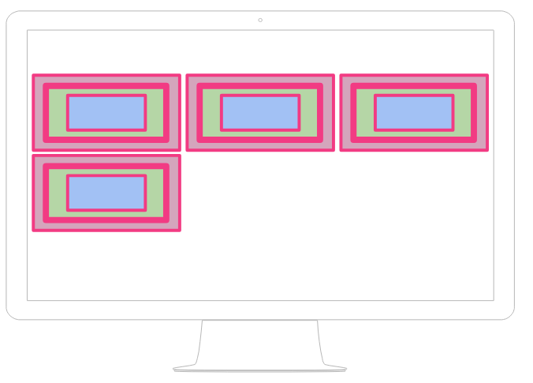
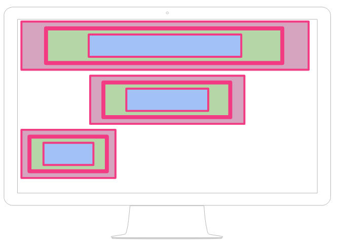

## Flujo de los elementos

Después de los consejos prácticos que os he presentado en el apartado anterior, en este apartado vamos a aclarar una serie de consideraciones en relación al maquetación Web.

### Consideraciones Importantes

- Debemos recordar que todas las etiquetas que se van a representar son _cajas_.

- Los navegadores no hacen **NADA** para controlar el diseño de nuestra página Web.

* Los navegadores, lo único que hacen es mostrar los elementos de nuestra página HTML en el mismo **ORDEN** en el que los hemos escrito.

* Siguen sólo dos reglas básicas dependiendo de las propiedades de las cajas:

Determinados tipos de caja se van poniendo unas detrás de otros mientras quepan en la pantalla.

Cuando no caben las cajas pasan a la "siguiente línea" del navegador.

Otros tipos de caja provocan un "salto de línea".

Y no hay más. Todas estas propiedades de las cajas, toda la maquetación, debemos hacer nosotros usando CSS.

Y eso es lo que vamos a empezar a ver a partir del siguiente apartado.

Curso desarrollado por [pekechis](http://github.com/pekechis) para [OpenWebinars](https://openwebinars.net/)
