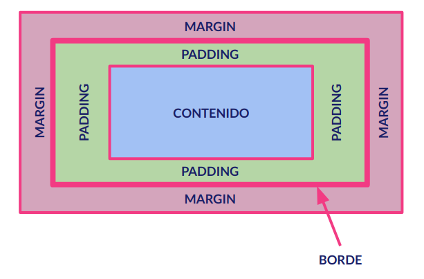

## Box-Sizing

En cursos anteriores y en apartados de este mismo curso ya hemos comentado que todos los elementos de HTML al ser representados en los navegadores son _cajas_. Esas cajas tiene los siguiente elementos y apariencia:



- **Contenido** es la zona donde va el elemento propiamente dicho.
- **Padding** es la distancia entre el contenido y el borde.
- El **Borde** es el límite entre el elemento y el resto de los elementos.
- EL **Margin** es la separación entre el elemento y los demás elementos.

También recordamos que la maquetación web consiste en disponer estas cajas para que cada una ocupa el lugar que queremos al ser mostradas en nuestro navegador.

Para conseguir esto nos encontramos que los elementos al ser representados en el navegador ocupan el siguiente espacio:

- La altura del elemento: altura del contenido + el padding + el borde.
- La anchura del elemento: anchura del contenido + el padding + el borde.

En esas circunstancias, y con un diseño complejo, cuando queramos cuadrar todo perfectamente vamos a tener que echar cuentas de todo, sumar todo para todas las cajas, añadir los márgenes etc...

En layouts sencillos no hay problema pero la cosa se complica si mi diseño es complejo.

La mejor solución para eso es establecer la propiedad CSS **_box-sizing:border-box_** y de esta manera no tendremos que echar cuentas con los bordes y los _paddings_. El tamaño que demos al elemento será la suma de todo.

Si queremos que siempre sea así añadiremos las siguiente líneas a mi CSS:

```css
html {
  -webkit-box-sizing: border-box;
  -moz-box-sizing: border-box;
  box-sizing: border-box;
}

*,
*:before,
*:after {
  -webkit-box-sizing: inherit;
  -moz-box-sizing: inherit;
  box-sizing: inherit;
}
```

Es algo que **DEBEMOS** hacer siempre ya que nos facilitará mucho la vida a la hora de maquetar.

### Otras posibilidades

La propiedad **_box-sizing_** puede tener otros dos valores:

- **_content-box_** que es el funcionamiento por defecto antes comentado.
- **_padding-box_** que no tienen en cuenta el borde pero si el padding y el contenido.

Curso desarrollado por [pekechis](http://github.com/pekechis) para [OpenWebinars](https://openwebinars.net/)
